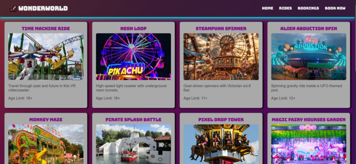
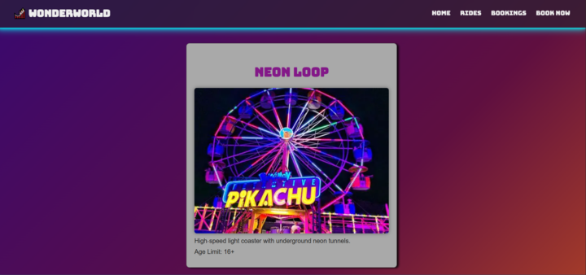
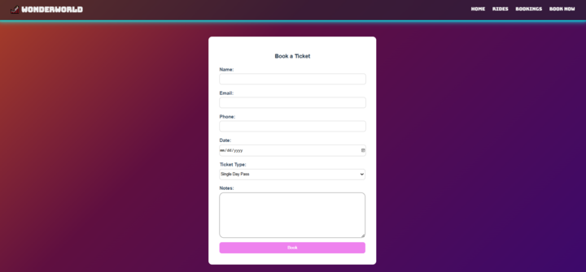
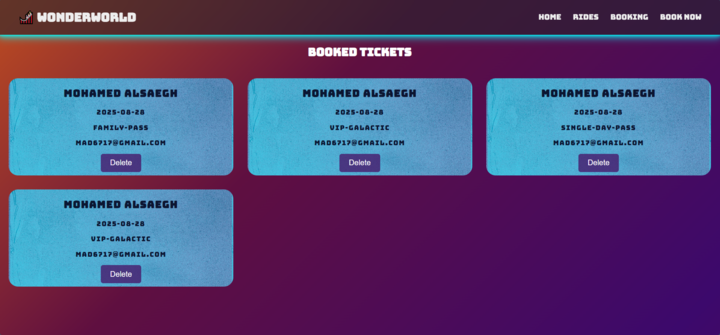

# WONDERWORLD

## 📝 Description

**Wonder World** is Theme Park management and booking Website. built during a Three-days hackathon. Designed exclusively for admin use, the app offers a vibrant and functional interface for managing theme park activities.

While the website does not support end-user access. It focuses on delivering an enjoying admin experience that blends usability, fun, and efficiency.

---

## 📋 Table of Contents

- [📝 Description](#-description)
- [📋 Table of Contents](#-table-of-contents)
- [🛠️ Technologies](#-technologies)
- [🖼️ Screenshots](#-screenshots)
- [✨ Possible Future Enhancements](#-possible-future-enhancements)
- [🙌 Credits](#-credits)

---

- [GitHub Repository Front-End](https://github.com/hussainmohd03/Theme-park-Booking-System-frontend#)
- [GitHub Repository Back-End](https://github.com/hussainmohd03/Theme-park-Booking-System-backend#)

- Deployed Front-End
- Deployed Back-End

---
## 🛠️ Technologies

- **Front-End : `React`**
- **Back-End : `Node.js`** & **`Express.js`** & **`MongoDB`** & **`Mongoose`**

- **Deployment : Front-End: `Surge`** & **BackEnd: `Fly.io`**

# **Screenshots**

This Screenshot showcases the **main dashboard interface** 
- **Home:** Overview and navigation hub for the Website
- **Rides:** Displays available theme park ideas with visual elements
- **Bookings:** Review all bookings
- **Book Now:** Booking Form 

The Booking Page provides a responsive and user-friendly form for admins to:
- Select a ride from the available list.

This screen displays detailed information about individual bookings

- The form which includes name,email,phone,date,ticket type, and leave a note

- Booked tickets section

## **✨ Possible Future Enhancements**

- Add User-Side experience for booking tickets
- Implement Authentication and Admin roles

## **🙌 Credits**
-  [The glow 60s edition](https://codepen.io/jpbarth/pen/VyyegV) 
- [Pure CSS Button Hover Glow Effect](https://codepen.io/leandrosimoes/pen/VqZxaG)
- [50 Beautiful Website Color Schemes & CSS Hex Codes (2025)](https://hookagency.com/blog/website-color-schemes-2020/)
- [Blue papper backgrond vectors, photos and PSD files | Free download](https://www.freepik.com/search?format=search&last_filter=query&last_value=blue+papper+backgrond&query=blue+papper+backgrond&selection=1)

----
# 👤 Authors (Developed by)

### Mohamed Alsaegh

📫 Email: [mad6717@gmail.com](mailto:mad6717@gmail.com) | 🔗 GitHub: [MohamedAlsaegh](https://github.com/MohamedAlsaegh) | 💼 LinkedIn: [Mohamed Alsaegh](https://www.linkedin.com/in/mohamed-alsaegh-304ab31a3/)

### Fawaz Aljar

📫 Email: [faaljar2@gmail.com](mailto:faaljar2@gmail.com) | 🔗 GitHub: [Fawaz Aljar](https://github.com/10Fawaz) | 💼 LinkedIn: [Fawaz Aljar](https://www.linkedin.com/in/fawaz-aljar-77900a36a/)

### Hussain Ahmed

📫 Email: [ha60412@gmail.com](mailto:ha60412@gmail.com) | 🔗 GitHub: [Hussain Ahmed](https://github.com/hussainmohd03) | 💼 LinkedIn: [Hussain Ahmed](https://www.linkedin.com/in/hussainahmed26/)
